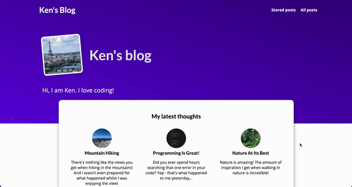

# My Django Blog Website
Welcome to the My Django Blog Website repository! This project is a simple, yet functional blog website built using the Django web framework. It allows users to read, create, and manage blog posts, as well as leave comments on them. The website is easy to customize and extend with new features, making it a great starting point for anyone looking to create their own blog or learn Django.

## Features
- User authentication (register, login, logout)
- CRUD operations for blog posts
- Commenting system with moderation
- Category and tag support for blog posts
- Pagination and search functionality
- Responsive design for mobile devices
- Admin dashboard for managing blog content

## Requirements
- Python 3.8 or higher
- Django 3.2 or higher
- Other dependencies listed in requirements.txt

## Getting Started
To get started with this project, follow these steps:

1. Clone the repository:

```
git clone https://github.com/KenAtopos/Django_blog_app.git
cd my-django-blog-website
```

2. Create a virtual environment and activate it:

```
python -m venv venv
source venv/bin/activate  # On Windows, use `venv\Scripts\activate`
```
3. Install the required dependencies:

```
pip install -r requirements.txt
```

4. Apply the database migrations:

```
python manage.py migrate
```

5. Create a superuser to access the admin dashboard:

```
python manage.py createsuperuser
```

6. Run the development server:

```
python manage.py runserver
```

7. Open your browser and navigate to `http://127.0.0.1:8000/` to view the website, or go to `http://127.0.0.1:8000/admin` to access the admin dashboard.


# Demo
